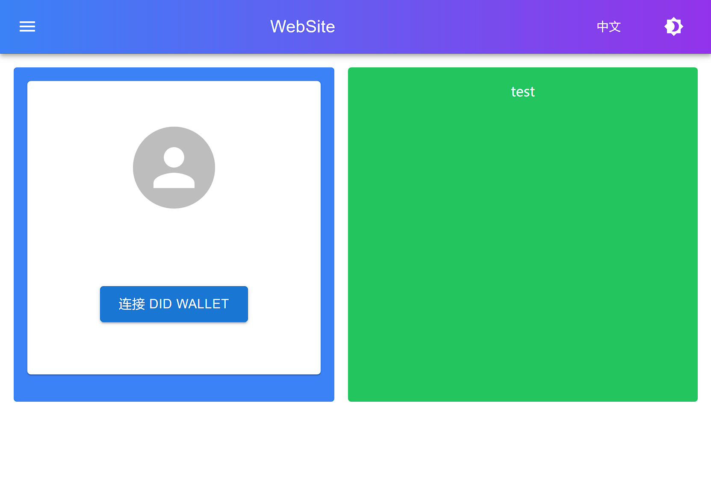
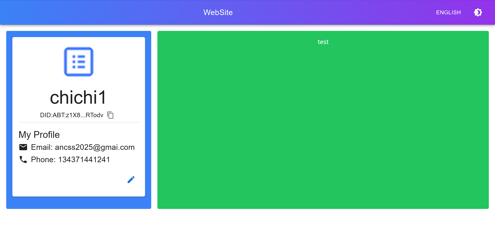
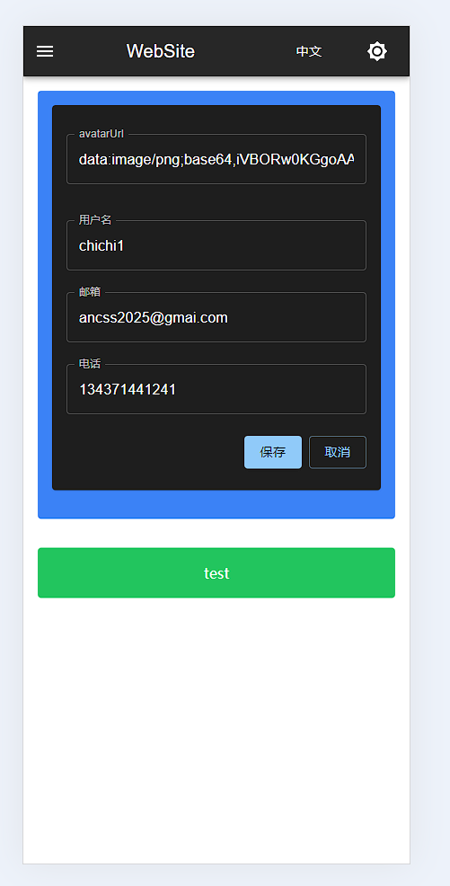

# 项目功能文档

## 1. 前端框架和UI
- 使用 React 作为主要的前端框架
- 采用 Material-UI 构建用户界面
- 使用 Tailwind CSS 进行样式定制
- 支持主题切换

## 2. 状态管理和数据获取
- 使用 Redux 进行状态管理
- 采用 React Query 处理服务器状态和数据获取

## 3. 表单处理和验证
- 使用 `react-hook-form` 进行表单管理
- 结合 `zod` 和 `@hookform/resolvers` 进行表单验证

## 4. 国际化
- 使用 `i18next` 和 `react-i18next` 实现多语言支持
- 通过 `i18next-browser-languagedetector` 自动检测用户语言偏好

## 5. 后端服务
- 使用 Express.js 构建后端 API
- 采用 Prisma + Sqlite ,进行数据库操作

## 6. 开发工具和优化
- 使用 TypeScript 进行静态类型检查
- 采用 Vite 作为构建工具,提高开发效率
- 使用 ESLint 和 Prettier 进行代码规范和格式化

## 7. 测试
- 使用 Jest 和 React Testing Library 进行单元测试和集成测试

# ScreenShots

## 1. 未登录 + PAD

## 2. 已登录 + PC

## 3. 编辑表单 + Mobile

